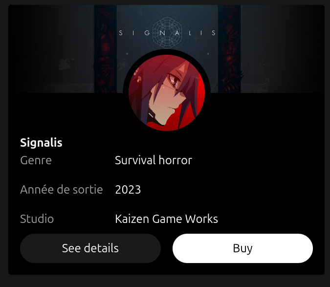
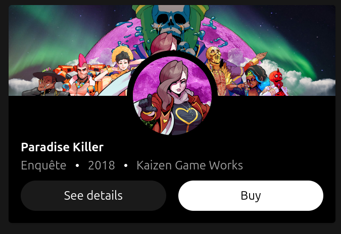
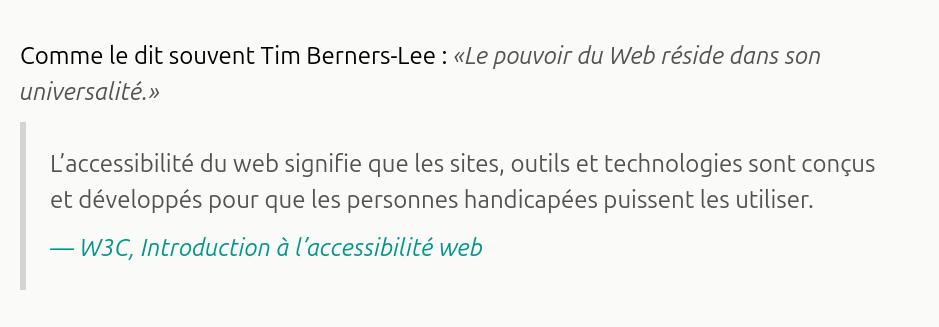
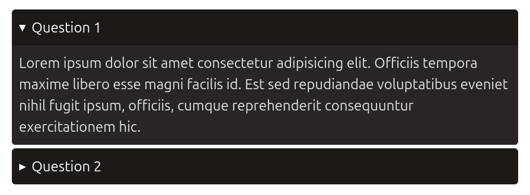
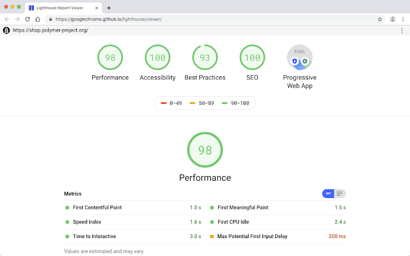

Entrée en matière : Définition
====

# Qu’est-ce que l’accessibilité [a11y] ?

- Ensemble de pratiques permettant à tous les utilisateurs, y compris les personnes en situation de handicap, d’accéder aux contenus et fonctionnalités d’un site.
- Elle couvre la perception, la compréhension, la navigation et l’interaction.

<!-- end_slide -->

Entrée en matière : Enjeux et Points Clés
===

# Enjeux
- Améliore l’expérience utilisateur pour tous.
- Optimise le référencement (SEO) en rendant le contenu plus compréhensible pour les moteurs de recherche.
- Respecte les obligations légales (WCAG, RGAA).

# Points importants
- Utilisation correcte des attributs **ARIA**.
- Possibilité de **focus** clair sur tous les éléments interactifs (liens, boutons, formulaires).
- Structuration logique avec titres, listes et alternatives textuelles pour les images.

<!-- end_slide -->


HTML Sémantique : Définition
===

# Qu’est-ce que le HTML sémantique ?
- Utiliser les balises selon leur rôle et leur signification, et non uniquement pour la mise en forme.  
- Exemple : `<header>`, `<main>`, `<article>`, `<footer>` au lieu de simples `<div>`.

# Enjeux

- **Accessibilité** : les lecteurs d’écran comprennent mieux la structure de la page.  
- **SEO** : les moteurs de recherche indexent plus efficacement le contenu.  
- **Maintenabilité** : le code est plus clair et facile à maintenir.  

<!-- end_slide -->

HTML Sémantique : Bonnes pratiques
===

- Employer des titres hiérarchisés (`<h1>` à `<h6>`).  
- Préférer `<nav>` pour les menus, `<section>` pour regrouper du contenu, `<aside>` pour les informations annexes ou les sidebars.

```html
<header>
    <p>Mon Site Web</p>

    <nav aria-label="main navigation">
        <ul>
            <li><a href="#accueil">Accueil</a></li>
            <li><a href="#articles">Articles</a></li>
            <li><a href="#contact">Contact</a></li>
        </ul>
    </nav>
</header>
```

<!-- end_slide -->

HTML Sémantique : Exemple
===

```html
  <main>
    <h1>Mon Site Web</h1>

    <section id="accueil">
      <h2>Bienvenue</h2>
      <p>Bienvenue sur mon site qui démontre l’usage du HTML sémantique.</p>
    </section>

    <section id="articles">
      <h2>Articles récents</h2>
      <article>
        <h3>Titre de l’article</h3>
        <p>Contenu de l’article. C’est ici que le texte principal apparaît.</p>
      </article>
    </section>
  </main>

  <aside>
    <h2>Informations</h2>
    <p>Un bloc secondaire : liens utiles, infos supplémentaires, publicité.</p>
  </aside>
```

<!-- end_slide -->

HTML Sémantique : Suite
===

Contrairement à certaines idées reçues, on peut tout à fait avoir plusieurs `<header>`, `<footer>`, 
ou `<nav>` sur la même page.

```html
<article>
  <header>
    <h2>Titre de l’article</h2>
    <p>Publié le <time datetime="2025-10-03">3 octobre 2025</time> par <span>Auteur</span></p>
  </header>

  <p>
    Voici le contenu principal de l’article.  
    On y trouve du texte, des liens, voire des images.
  </p>

  <footer>
    <p>Catégorie : <a href="#tech">Technologie</a></p>
    <p><a href="#commentaires">3 commentaires</a></p>
  </footer>
</article>
```
<!-- end_slide -->

HTML Sémantique : Headings
===

- Ne PAS choisir le niveau de titre pour des raisons visuelles
- ~~Chaque page doit contenir exactement un h1~~
- On peut avoir un h1 par section (article/section/nav) mais ce n'est franchement pas l'idéal
- Les Headings doivent être hiérarchisés si bien que l'on puisse en déduire une table des matières

```html
<h1>Titre de la page</h1>
<article>
    <h2>Titre de l'article</h2>
    <p>Lorem</p>

    <section>
        <h3>Titre de sous-section de l'article</h3>
        <p>Lorem</p>
    </section>

    <section>
        <h3>Titre de sous-section de l'article</h3>
        <p>Lorem</p>
    </section>
</article>

<section>
    <h2>Titre de section</h2>
    <p>Lorem</p>
</section>

<!--
Titre de la page
    1 - Titre de l'article
        a - Titre de sous-section de l'article
        b - Titre de sous-section de l'article
    2 - Titre de section
-->
```

<!-- end_slide -->

HTML Sémantique : Headings, difficultés
===

Ce n'est pas toujours évident à respecter:
- section avec titre visuellement manquant sur le design
- component dont le titre peut changer de niveau selon le contexte

```html
<article>
    <h2>Titre de l'article</h2>
    <p>Lorem</p>
</article>

<section aria-labelledby="article-card-title">
    <!-- Le design n'incorpore peut être pas ce titre ? Peut on vraiment le cacher ? -->
    <h2 id="article-card-title" class="sr-only">Articles les plus consultés</h2>

    <ol>
        <li>
            <article>
                <!-- Oh oh ... il va falloir gérer ce cas de figure...-->
                <h2>Titre de l'article</h2>
                <p>Lorem</p>
            </article>
        </li>
    </ol>
</section>
```

```html
<!-- On peut éventuellement donner un "titre" à la section sous forme d'aria, mais là encore ce n'est pas idéal -->
<section aria-label="Section des articles les plus consultés">
    <ol>
        <li>
            <article>
                <!-- Maintenant valide, mais on sent qu'il manque un vrai titre à la section -->
                <h2>Titre de l'article</h2>
                <p>Lorem</p>
            </article>
        </li>
    </ol>
</section>
```

<!-- end_slide -->

Accessibilité : Contraste
===

# Définition
- Le contraste désigne la **différence de luminosité et de couleur** entre le texte et son arrière-plan.  
- Un bon contraste facilite la **lecture pour tous**, notamment les personnes malvoyantes ou daltoniennes.

# Bonnes pratiques
- Respecter un **ratio minimum de 4.5:1** pour le texte normal et 3:1 pour le texte large (WCAG 2.1).  
- Tester les combinaisons de couleurs avec des outils comme [Contrast Checker](https://contrast-ratio.com/).  
- Éviter les textes clairs sur fonds clairs ou textes foncés sur fonds foncés.

<!-- end_slide -->

Accessibilité : Faciliter la lecture du contenu
===

# Conseils de base
- Limiter la largeur des lignes à environ **80 caractères (80ch)** pour faciliter la lecture.  
- Éviter `text-align: justify`, qui peut créer des espaces irréguliers difficiles à suivre pour les personnes dyslexiques.  
- Préférer un **espacement suffisant** entre les lignes (`line-height` 1.4–1.6).  
- Utiliser des **polices lisibles** sans empattement (`sans-serif`) pour le corps du texte.  
- Ne pas se reposer sur l'utilisation de couleurs pour distinguer des boutons mais plutôt s'appuyer sur des icons
- Les liens doivent constraster clairement
- Evitez les longs textes intégralement en majuscules
- Les blocs de texte devraient avoir une marge basse proportionnelle à leur taille de police (utilisez des `em`)

## Exemple CSS recommandé

```css
.text-container {
  max-width: 80ch;
}
```

<!-- end_slide -->

Accessibilité : Préférences utilisateur en CSS
===

# prefers-reduced-motion
- Permet de respecter la préférence de l’utilisateur qui souhaite **limiter les animations et transitions**.  
- Important pour les personnes sujettes au **mal de mer numérique** ou à des troubles de l’attention.  

## Exemple
```css
@media (prefers-reduced-motion: reduce) {
  * {
    animation: none !important;
    transition: none !important;
  }
}
```

# prefers-color-scheme
- Adapte l’affichage au mode clair ou mode sombre défini par l’utilisateur.
- Améliore le confort visuel et l’accessibilité.

## Exemple
```css
html {
    /* Autorise aussi bien le mode light que dark */
    color-scheme: light dark;
}

/* On lit les préférences utilisateurs */
@media (prefers-color-scheme: dark) {
  body {
    background-color: #111;
    color: #eee;
  }
}
```

<!-- end_slide -->

Accessibilité : Les images en HTML
===

# L’attribut `alt`
- **Obligatoire pour toutes les images de contenu**.  
- Fournit une **description textuelle** aux lecteurs d’écran.  
- Exemples :  

```html

```

# Alt, vraiment nécessaire ?

Pour les images purement décoratives:
- utiliser alt="" 
- ou encore l'attribut role="presentation".
- ou bien favorisez un "background-image" en css

```html


<!-- ou -->

<div class="with-bg-image"></div>
```

# Recap
balise `img`: pour contenu informatif ou essentiel.
background-image ou img 'presentation': pour décoration uniquement, ne doit pas véhiculer d’information.

<!-- end_slide -->

Accessibilité : Le Focus
===

# Définition
- Le **focus** indique quel élément interactif est actuellement sélectionné ou activé par le clavier.  
- Typiquement, les liens, boutons, champs de formulaire et autres composants peuvent recevoir le focus.

# Importance
- Essentiel pour les **utilisateurs naviguant au clavier** ou avec des aides techniques.  
- Permet de comprendre **où l’on se trouve** dans la page sans utiliser la souris.  
- Impact direct sur l’accessibilité et la facilité d’usage.

# Bonnes pratiques
- **Toujours rendre visible le focus** via `:focus` ou `:focus-visible` CSS ou styles personnalisés.  
- Respecter un ordre **logique et prévisible** dans la navigation au clavier.  
- Ne pas retirer le focus visuel avec `outline: none` sans le remplacer par un indicateur clair.  

> Gérer correctement le focus dans les modales, onglets (role="tab") et dialogues (focus trap).

# Manipuler le focus
```html
<a>Certains éléments sont naturellement focusables</a>

<span tabindex="0">On peut rendre n'importe quel élément focusable avec tabindex="0"</span>

<a tabindex="-1">Avec la valeur -1, l'élément ne peut plus être mis en focus de façon naturelle</a>
```

<!-- end_slide -->

Accessibilité : Masquer du contenu
===

# CSS : `visibility: hidden` vs `display: none`

| Propriété               | Effet visuel | Impact sur le DOM / accessibilité |
|-------------------------|--------------|---------------------------------|
| `visibility: hidden`    | Le contenu **n’est pas visible**, mais l’élément **occupe toujours de l’espace** | Les lecteurs d’écran **ignorent** le contenu (non accessible) |
| `display: none`          | Le contenu est **complètement supprimé du flux** | Le contenu est **inaccessible aux lecteurs d’écran**, et n’occupe aucun espace |

# HTML : attribut `hidden`

Équivaut à display: none en CSS.
Le contenu est invisible et ignoré par les technologies d’assistance.
Utile pour masquer des sections temporaires ou dynamiques.

```html
<p hidden>Texte masqué</p>
```

# Bonne pratique

Ne pas utiliser display: none ou hidden pour cacher du contenu important à l’accessibilité.

Pour cacher visuellement mais garder accessible, privilégier :

```css
/*class tailwind rendant invisible un élément tout en le laissant visible aux lecteurs d'écrans */
.sr-only {
    position: absolute;
    width: 1px;
    height: 1px;
    padding: 0;
    margin: -1px;
    overflow: hidden;
    clip: rect(0, 0, 0, 0);
    white-space: nowrap;
    border-width: 0;
}
```

<!-- end_slide -->


Accessibilité : Attribut `aria-label`
===

# Rôle
- Fournir une **description textuelle** aux technologies d’assistance (lecteurs d’écran).  
- Utile quand un élément interactif n’a pas de texte visible suffisamment clair.  

```html
<!-- ❌ Rien n'indique ce que ce bouton est supposé faire si l'icon ne peut être vue -->
<button>
  <i class="fa fa-eye"></i>
</button>

<!-- ✅ Ici le lecteur d'écran annoncera clairement le rôle du bouton -->
<button aria-label="Rechercher">
  <i class="fa fa-eye"></i>
</button>

<!-- ✅ Ajouter un 'title' confère un tooltip natif mais ne dispense pas du aria-label -->
<button title="Rechercher" aria-label="Rechercher">
  <i class="fa fa-eye"></i>
</button>
```

<!-- end_slide -->

Accessibilité : `aria-labelledby`
===

# Rôle
- Fournit une **relation entre un élément et un ou plusieurs éléments existants** servant de label.  
- Utile quand le texte descriptif est déjà visible ailleurs sur la page.

## Exemple : section

```html
<section aria-labelledby="section-title">
  <h2 id="section-title">Titre de ma section</h2>
  <p>
    Lorem ipsum dolor sit amet, consectetur adipiscing elit, sed do eiusmod tempor incididunt ut labore et dolore magna aliqua. Ut enim ad minim veniam, quis nostrud exercitation ullamco laboris nisi ut aliquip ex ea commodo consequat. Duis aute irure dolor in reprehenderit in voluptate velit esse cillum dolore eu fugiat nulla pariatur. Excepteur sint occaecat cupidatat non proident, sunt in culpa qui officia deserunt mollit anim id est laborum.
  </p>
</section>
```

<!-- end_slide -->
Accessibilité : `aria-describedby`
===

# Rôle
- Associe un élément interactif à une **description supplémentaire**.  
- Utile pour donner un **contexte ou une conséquence** d’une action.

## Exemple : bouton de suppression

```html
<p id="delete-desc">
  En cliquant sur ce bouton, l’élément sera définitivement supprimé.
</p>

<button aria-describedby="delete-desc">
  Supprimer
</button>
```
<!-- end_slide -->

Accessibilité : `aria-live`
===

# Définition
- L’attribut `aria-live` informe les technologies d’assistance qu’une zone du contenu sera **mise à jour dynamiquement**.  
- Le lecteur d’écran lit automatiquement le nouveau contenu sans déplacer le focus.

## Exemple 1 : message d’erreur sous un champ

```html
<label for="email">Email</label>
<input type="email" id="email" aria-describedby="email-error">

<p id="email-error" aria-live="assertive" style="color:red;">
  <!-- Ce message sera rempli dynamiquement -->
</p>
```

## Exemple 2 : notification (toast)

```html
<div id="toast" aria-live="polite" class="toast">
  <!-- Notification ajoutée par JavaScript -->
</div>
```

<!-- end_slide -->

Accessibilité : États et relations avec ARIA
===

# Attributs courants
- **`aria-controls`** : indique quel élément est contrôlé par l’action.  
- **`aria-expanded`** : décrit si un élément est ouvert (`true`) ou fermé (`false`).  
- **`aria-selected`** : indique l’état de sélection d’un onglet, d’un item de liste, etc.  

---

## Exemple : onglets accessibles

```html
<div role="tablist">
  <button role="tab" aria-selected="true" aria-controls="panel1" id="tab1">
    Onglet 1
  </button>
  <button role="tab" aria-selected="false" aria-controls="panel2" id="tab2">
    Onglet 2
  </button>
</div>

<div id="panel1" role="tabpanel" aria-labelledby="tab1">
  Contenu du premier onglet.
</div>
<div id="panel2" role="tabpanel" aria-labelledby="tab2" hidden>
  Contenu du second onglet.
</div>
```

- Référence: https://developer.mozilla.org/en-US/docs/Web/Accessibility/ARIA/Reference/Roles/tab_role

<!-- end_slide -->

Les Landmarks : Concept
===

# Définition
- Un **landmark** est une région importante d’une page web permettant aux utilisateurs et aux technologies d’assistance de **naviguer rapidement**.  
- Exemples classiques : `<header>`, `<main>`, `<nav>`, `<footer>`, `<aside>`.

# Avantages
- Navigation facilitée pour les lecteurs d’écran.  
- Amélioration de l’expérience utilisateur et de l’accessibilité générale.

<!-- end_slide -->

Les Landmarks : le cas particulier des `<section>`
===

# Règle
- Une `<section>` devient un landmark UNIQUEMENT si elle possède :  
  - un `aria-label` **ou**  
  - un `aria-labelledby` pointant vers un élément existant.  

## Avec aria-label

```html
<section aria-label="Articles récents">
  <h2>Derniers articles</h2>
  <article>...</article>
</section>
```

## Avec aria-labelledby
```html
<!-- via un aria-labelledby qui référence le titre -->
<section aria-labelledby="section-title">
  <h2 id="section-title">Derniers articles</h2>
  <article>...</article>
</section>
```

> Faites ceci uniquement sur les éléments `<section>` qui méritent d'être considérés comme des "Landmarks"

[Vidéo sur le Sujet de Kevin Powell](https://www.youtube.com/watch?v=ULdkpU51hTQ)

<!-- end_slide -->


Les rôles ARIA : Introduction
===

# Définition
- L’attribut `role` indique **la fonction d’un élément** aux technologies d’assistance.  
- Permet de rendre des éléments non sémantiques interactifs ou clarifier le rôle d’éléments existants.


```html
<!-- ATTENTION ce bouton est "focusable" et gère le clique, mais PAS le "onkeydown:Enter" -->
<span role="button" tabindex="0" onclick="alert('Cliqué !')">
  Cliquer ici
</span>
```

<!-- end_slide -->

Les rôles ARIA : simuler des composants
===

# Avantages
- Permet de créer des **composants complexes** avec des `<div>` ou `<span>` tout en gardant l’accessibilité.  
- Donne **plus de contrôle sur le style et le layout** sans perdre les informations sémantiques pour les lecteurs d’écran.  

## Exemple : table faite uniquement de `<div>`

```html
<div role="table" aria-label="Tableau des ventes">
  <div role="rowgroup">
    <div role="row">
      <div role="columnheader">Produit</div>
      <div role="columnheader">Quantité</div>
      <div role="columnheader">Prix</div>
    </div>
  </div>
  <div role="rowgroup">
    <div role="row">
      <div role="cell">Pommes</div>
      <div role="cell">50</div>
      <div role="cell">20€</div>
    </div>
    <div role="row">
      <div role="cell">Bananes</div>
      <div role="cell">30</div>
      <div role="cell">15€</div>
    </div>
  </div>
</div>

```

<!-- end_slide -->

Balises HTML exotiques : `<dl>` `<dt>` `<dd>` (1 / 3)
===

# Liste de "définitions"

Idéal pour représenter une liste de paires "clé - valeurs"
```html
<dl>
    <dt>Terme 1</dt>
    <dd>Définition du terme 1</dd>

    <dt>Terme 2</dt>
    <dd>Définition du terme 2</dd>
</dl>
```

Chaque paire peut être regroupée dans une `<div>` si besoin

```html
<!-- HTML valide -->
<dl>
    <div>
        <dt>Terme 1</dt>
        <dd>Définition du terme 1</dd>
    </div>

    <div>
        <dt>Terme 2</dt>
        <dd>Définition du terme 2</dd>
    </div>
</dl>
```

<!-- end_slide -->

Balises HTML exotiques : `<dl>` `<dt>` `<dd>` (2 / 3)
===
<!-- column_layout: [2, 1] -->

<!-- column: 0 -->

```html
<article class="shadow-sm rounded-sm overflow-hidden bg-black">
<figure class="bg-[url(https://www.nintendo.com/eu/media/images/10_share_images/games_15/nintendo_switch_4/2x1_NSwitch_Signalis_image1600w.jpg)] relative bg-cover">
    
  </figure>
  <div class="mt-10 p-4 grid gap-2">
    <div>
      <h2 class="font-bold text-white">Signalis</h2>
      <dl class="grid grid-cols-[auto_1fr] gap-4">
        <dt class="text-neutral-400">Genre</dt>
        <dd class="">Survival horror</dd>
        <dt class="text-neutral-400">Année de sortie</dt>
        <dd class="">2023</dd>
        <dt class="text-neutral-400">Studio</dt>
        <dd>Kaizen Game Works</dd>
      </dl>
    </div>
    <div class="grid grid-cols-2 gap-4">
      <button class="w-full text-center text-white p-2 bg-white/10 rounded-full hover:bg-white/30 transition-colors">See details</button>
    <button class="w-full text-center text-black p-2 bg-white rounded-full hover:bg-white/90 transition-colors">Buy</button>
    </div>
  </div>
</article>
```

<!-- column: 1 -->



<!-- reset_layout -->


<!-- end_slide -->

Balises HTML exotiques : `<dl>` `<dt>` `<dd>` (3 / 3)
===

Si le nom des labels ne fait pas partie du design, on peut ruser et l'inclure en "sr-only" (classe tailwind)
rendant un élément visuellement invisible, mais qui reste dans le DOM et sera interprété par les lecteurs d'écrans.

<!-- column_layout: [2, 1] -->

<!-- column: 0 -->

```html
<article class="shadow-sm rounded-sm overflow-hidden bg-black">
    <h2 class="font-bold text-white">Paradise Killer</h2>
    <dl class="flex flex-wrap gap-3">
        <dt class="sr-only">Genre</dt>
        <dd class="flex items-center gap-3 text-neutral-400">Enquête</dd>
        <dt class="sr-only">Année de sortie</dt>
        <dd class="flex items-center gap-3 text-neutral-400 before:size-1 before:bg-white  before:rounded-full">2018</dd>
        <dt class="sr-only">Studio</dt>
        <dd class="flex items-center gap-3 text-neutral-400 before:size-1 before:bg-white  before:rounded-full">Kaizen Game Works</dd>
    </dl>
</article>
```
<!-- column: 1 -->



<!-- reset_layout -->

<!-- end_slide -->

Balises HTML exotiques : `<address>`
===

# Définition
- L’élément `<address>` sert à indiquer les **coordonnées de contact** d’une personne, d’une organisation ou de l’auteur d’un contenu.  
- Il peut contenir : adresse postale, e-mail, téléphone, lien vers un profil, etc.  
- Sa sémantique aide les outils (navigateurs, moteurs, lecteurs d’écran) à **identifier une section de contact**.

---

## Exemple

```html
<address>
  <p>
    Site créé par <a href="mailto:contact@example.com">contact@example.com</a><br>
    42 rue du Web, 75000 Paris<br>
    France
  </p>
</address>
```

> Le contenu est interprété comme informations de contact, pas simplement comme du texte.

<!-- end_slide -->

Balises HTML exotiques : `<blockquote>`, `<q>` et `<cite>`
===

# Définition
- **`<blockquote>`** : pour une **citation longue ou externe**, souvent présentée en bloc.  
- **`<q>`** : pour une **citation courte intégrée** dans une phrase.  
- **`<cite>`** : pour indiquer la **source** ou **l’auteur** d’une citation ou d’une œuvre.

## Exemple complet


```html
<p>
  Comme le dit souvent Tim Berners-Lee :
  <q>Le pouvoir du Web réside dans son universalité.</q>
</p>

<blockquote cite="https://www.w3.org/WAI/fundamentals/accessibility-intro/">
  <p>
    L’accessibilité du web signifie que les sites, outils et technologies sont conçus
    et développés pour que les personnes handicapées puissent les utiliser.
  </p>
  <cite>— W3C, Introduction à l’accessibilité web</cite>
</blockquote>
```



- [Comment styliser les blockquotes](https://css-tricks.com/snippets/css/simple-and-nice-blockquote-styling/)
- [Exemples de stylisation](https://css-tricks.com/examples/Blockquotes/)

<!-- end_slide -->

Balises HTML exotiques : `<time>`
===

# Définition
- inline
- L’élément `<time>` sert à **marquer une date, une heure ou une durée** dans le contenu.  
- Améliore la **compréhension sémantique** pour les moteurs de recherche, les lecteurs d’écran et les scripts.

## Exemple simple

```html
<p>Publié le <time datetime="2025-10-05">5 octobre 2025</time>.</p>
```
## Durée

On peut ajouter le prefix `PT` pour indiquer une durée.

```html
<!-- ISO 8601 pour les durées : PT = période de temps, ici 2h30min. -->
<time datetime="PT2H30M">2 heures 30 minutes</time>
```

# Recap
- Toujours fournir l’attribut datetime pour que la valeur soit interprétable automatiquement.
- Utiliser `<time>` pour les dates de publication, événements, horaires, durées, etc.

> Un petit élément, mais essentiel pour l’accessibilité et la sémantique temporelle.

<!-- end_slide -->

Balises HTML exotiques : `<details>` et `<summary>`
===

# Définition
- `<details>` crée un **conteneur déroulable**, utile pour cacher ou révéler du contenu.  
- `<summary>` définit le **titre cliquable** qui contrôle l’ouverture du détail.

## Exemple HTML

```html
<details>
    <summary>En savoir plus</summary>
    <p>Voici du contenu additionnel qui peut être affiché ou caché.</p>
</details>
```

# Accordeons natifs

On peut dorénavant donner un `name` pour regrouper sémantiquement plusieurs `details`.

Ainsi, ouvrir l'un de ces éléments fermera naturellement les autres portant le même 'name'

## Exemple HTML

<!-- column_layout: [1, 1] -->

<!-- column: 0 -->

```html
<details name="faq">
    <summary>Question 1</summary>
    <p>Réponse 1</p>
</details>

<details name="faq">
    <summary>Question 2</summary>
    <p>Réponse 2</p>
</details>
```

<!-- column: 1 -->



<!-- end_slide -->

Balises HTML exotiques : `<dialog>`
===

# Définition
- L’élément `<dialog>` permet de créer une **boîte de dialogue native** (modale ou non modale).  
- Accessible par défaut (focus trap natif (ou presque...), rôle de dialogue implicite).

# Utilisation en JavaScript

```html
<dialog id="myDialog">
  <p>Voulez-vous confirmer la suppression ?</p>
  <button id="closeBtn">Fermer</button>
</dialog>

<button id="openBtn">Ouvrir</button>

<script>
  const dialog = document.getElementById('myDialog');
  document.getElementById('openBtn').onclick = () => dialog.showModal(); // modal
  document.getElementById('closeBtn').onclick = () => dialog.close();
</script>
```

# Limitations

- Focus trap imparfait
- Relativement difficile à styliser / animer
- Pas de 'dismiss' natif (fermer au click sur le backdrop)
- On ne peut pas avoir plusieurs `dialog` ouverts à la fois (pas de "stack" de modals)

<!-- end_slide -->

Balises HTML exotiques : `<figure>` et `<figcaption>`
===
# Définition
- `<figure>` regroupe un **contenu autonome** : image, graphique, code, vidéo, citation, etc.  
- `<figcaption>` fournit une **légende descriptive** liée à ce contenu.  
- Ensemble, ils améliorent la **sémantique** et l’**accessibilité** du document.

## Exemple

```html
<figure>
  
  <figcaption>
    Figure 1 — Les quatre principes fondamentaux de l’accessibilité (POUR).
  </figcaption>
</figure>
```

<!-- end_slide -->

Balises HTML exotiques : `<code>`
===

# Définition
- `<code>` élément inline qui représente un extrait de code

## Exemple HTML
Astuce, "wrappez" le dans un `<pre>` pour conserver le format du code.
Si vous avez besoin de différentes couleurs, utilisez des `<span>`

```html
<pre>
    <code>
        let x = 42;
        let mut y = 11;
        y += x;
    </code>
</pre>
```

<!-- end_slide -->

Attribut HTML exotique : `popover`
===

# Définition
- `popover` est un **nouvel attribut HTML** permettant de créer des **contenus contextuels natifs** (info-bulle, menu, panneau, etc.) sans JavaScript complexe.  
- Fonctionne avec l’API intégrée du navigateur, plus accessible et cohérente que les solutions maison.

# Exemple simple

```html
<button popovertarget="context-menu">Plus d'actions</button>

<!-- Ne pas oublier de préciser le rôle du popover (tooltip, menu, dialog, grid, tree, listbox) -->
<div id="context-menu" popover role="menu">
  <ul>
    <li>
        <button>Details</button>
    </li>
    <li>
        <button>Editer</button>
    </li>
    <li>
        <button>Supprimer</button>
    </li>
  <ul>
</div>
```

> En octobre 2025, Firefox ne supporte toujours pas cet attribut, le rendant pour l'instant inutilisable.

<!-- end_slide -->

Technique avancée : Skip link
===

# Concept
- Un **lien invisible mais focusable** permet aux utilisateurs clavier ou aux lecteurs d’écran de **sauter directement au contenu principal** (`<main>`), sans parcourir tout le menu de navigation.

# Pourquoi c’est important
- Améliore la **navigation rapide** pour les personnes utilisant le clavier ou les aides techniques.  
- Respecte les recommandations WCAG pour la **navigation skip-link**.

## Exemple HTML

```html
<a href="#main-content" class="not-focus:sr-only">Aller au contenu principal</a>

<nav>
  <!-- menu de navigation -->
</nav>

<main>
  <!-- Skip link target for a11y -->
  <span tabindex="-1" id="main-content"></span>
  <h1>Bienvenue sur le site</h1>
  <p>Contenu principal...</p>
</main>
```

~~Notez le tabindex="-1" sur main afin de forcer le prochain "tab" à mettre en focus un élément enfant à main et non les liens de la nav, pourtant premiers dans le DOM.~~
Mettez plutôt un span focusable portant l'id au début de main, cela évite certains comportements étrange du navigateur.

<!-- end_slide -->

Technique avancée : rendre une "card" intégralement cliquable (1 / 3)
===

# Solution naîve
On peut bien sûr englober l'élément entier dans un lien, rendant ainsi toute la card cliquable.

```html
<a href="/article/id">
  <article>
    <figure>
      
    </figure>
    <h2>Titre de la card</h2>
    <p>Un peu de contenu</p>
  </article>
</a>
```

Mais cette solution connait vite des limites:
- on risque de casser du style en ajoutant ainsi un parent `<a>`
- il devient impossible d'inclure d'autres liens/boutons dans la card pour des actions secondaires

```html
<a href="/article/id">
  <article>
    <figure>
      
    </figure>
    <h2>Titre de la card</h2>
    <p>Un peu de contenu</p>

    <!-- Oups ! HTML invalide ! -->
    <a href="/article/id/details">Voir le détails</a>
    <button>Ajouter au panier</button>
  </article>
</a>
```
> Il est parfaitement interdit d'avoir des "liens dans des liens" !


<!-- end_slide -->

Technique avancée : rendre une "card" intégralement cliquable (2 / 3)
===

# Solution bricolage
Une autre solution consiste à avoir plusieurs liens facilement accessibles:
- un sur le titre de la card
- un autre, identique, sur l'image

```html
<article>
    <a href="/article/id">
        <figure>
            
        </figure>
    </a>
    <a href="/article/id">
        <h2>Titre de la card</h2>
    </a>

    <p>Un peu de contenu</p>

    <a href="/article/id/details">Voir le détails</a>
    <button>Ajouter au panier</button>
</article>
```

C'est tout à fait valide, mais loin d'être idéal:
- nous avons 2 liens identiques qui se suivent, il faudrait rendre l'un des deux tabindex="-1" pour éviter la confusion lors de la navigation au clavier
- les `<a>` wrappers peuvent casser l'architecture du component et son style
- la card n'est pas focusable en elle même: visuellement, c'est juste le titre qui sera "focused"

<!-- end_slide -->
Technique avancée : rendre une "card" intégralement cliquable (3 / 3)
===

# Solution moderne

Enfin, cette solution consiste à utiliser le selecteur CSS :focus-within.
- On cache le focus du lien principal
- Le lien principal se voit conféré un pseudo élément (before/after) absolu qui recouvre toute la card qui elle, est en position relative
- On donne à la card un "outline" quand un élément à l'intérieur est au focus.

```html
<!-- l'article semble visuellement sélectionné quand le lien principal est au focus -->
<article class="relative focus-within:outline-2 isolate">
    <figure>
        
    </figure>
    <!-- le lien ne recouvre que le titre, mais son pseudo-before, lui, recouvre toute la card -->
    <a href="/article/id" class="focus:outline-0 before:absolute before:inset-0 before:z-0">
        <h2>Titre de la card</h2>
    </a>

    <p>Un peu de contenu</p>

    <a href="/article/id/details">Voir le détails</a>
    <button>Ajouter au panier</button>
</article>
```

Résultat: 
- on a l'impression de focus la card complète quand on focus le lien principal
- on peut dorénavant cliquer sur l'ensemle de la card pour activer le lien principal
- les autres éléments intéractifs restent disponibles au clic et au focus

<!-- end_slide -->

Technique avancée : rendre les titres focusable
===

Une technique consiste à cacher des liens à l'intérieur des liens importants.

Le heading (h1, h2, h3...) est rendu focusable via un tabindex="-1"

Il contient un lien caché visuellement (simplement `opacity 0`) visible uniquement au focus.

Cela permet de facilement naviguer sur une page contenant beaucoup de texte en utilisant la touche tab pour sauter d'un titre à un autre.


```html
<h1 id="title" tabindex="-1" class="group relative">
    Titre de la page
    <a href="#title1" 
      aria-label="Lien vers Titre de la page" 
      class="group-hover:opacity-100 group-focus-within:opacity-100 opacity-0 absolute -left-3">
      #
    </a>
</h1>
```

> Par convention, le lien ne contient en général qu'un `#`, il faudra donc penser à indiquer ça destination via un aria-label clair.

On peut aussi faire apparaître le lien `#` au survol de la souris pour indiquer sa présence et faire comprendre que le site permet une navigation au clavier simplifiée.

- Exemple d'implémentation: https://splidejs.com/guides/accessibility


<!-- end_slide -->

Outils pour tester l'accessibilité de votre application web (1/1)
===

# DevTools
- Onglet "Accessibilité"

# Extensions pour navigateur

## Lighthouse
- Google "Lighthouse" est pré-intégré dans les navigateurs à base Chromium
- [Lighthouse pour Firefox](https://addons.mozilla.org/fr/firefox/addon/google-lighthouse/)



<!-- end_slide -->
Outils pour tester l'accessibilité de votre application web (2/2)
===

## Axe Dev Tool (payant)
- [Chrome](https://chromewebstore.google.com/detail/axe-devtools-web-accessib/lhdoppojpmngadmnindnejefpokejbdd?pli=1)
- [Firefox](https://addons.mozilla.org/fr/firefox/addon/axe-devtools/)

## WAVE Accessibility Extension
- [Chrome](https://chromewebstore.google.com/detail/wave-evaluation-tool/jbbplnpkjmmeebjpijfedlgcdilocofh?pli=1)
- [Firefox](https://addons.mozilla.org/fr/firefox/addon/wave-accessibility-tool/)


<!-- end_slide -->

Liens utiles et références
===

- [Documentation Mozilla](https://developer.mozilla.org/en-US/docs/Web/Accessibility/ARIA)
- ["Quick accessibility wins that are easy to implement" by Kevin Powell](https://www.youtube.com/watch?v=pJ0GPI7BMIs)
- ["Most sites have a skip-to-main link, and yours should too!" by Kevin Powell](https://www.youtube.com/watch?v=jDDaOFr9nqQ)
- [W3: Exemple de ce qu'il faut éviter](https://www.w3.org/WAI/demos/bad/?utm_source=chatgpt.com)
- [Conseils généraux concernant l'a11y web](https://developer.mozilla.org/en-US/docs/Learn_web_development/Core/Accessibility/HTML)
- [more on landmarks](https://www.w3.org/WAI/ARIA/apg/)
- [a11y project alt text article](https://www.a11yproject.com/posts/alt-text/)
- [Qu'est ce qu'un popover ?](https://css-tricks.com/clarifying-the-relationship-between-popovers-and-dialogs/)

